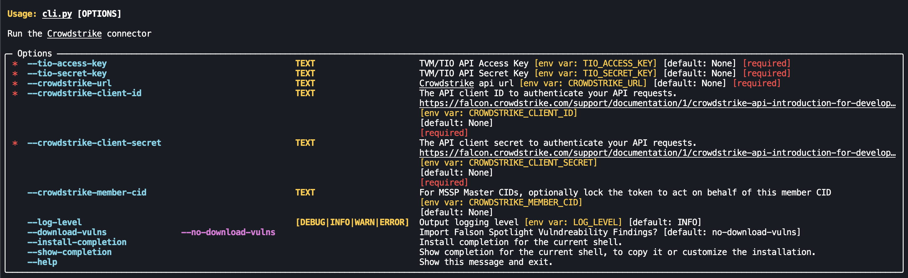

# Crowdstrike -> T1 Ingest Connector

This connector code will download the assets from Crowdstrike,
transform then upload to T1.

All job management is handled by the pyTenable sync JobManager (currently within the
`feature/sync` branch). As the sync JobManager isn't yet mainlined into the pyTenable
repository, there are a few extra steps involved to setup the connector command-line
(below).

- TIF Connector Status: _TODO_

## Installation

In order to be able to handle pulling from non-pypi based sources, and to better manage
the project as a whole, this codebase is dependent on `uv` for package management and
requires that you install it first. `uv` can be installed via `brew` or through any of
the methods detailed in the [uv installation guide](https://docs.astral.sh/uv/getting-started/installation/).

## Local Setup

```bash
# Setup a virtual environment with python 3.12
uv venv -p 3.12

# Update the lockfile with the latest pyTenable package
# from the feature branch
uv lock --upgrade-package pytenable

# Synchronize the virtual environment to match the packages
# within the lockfile.
uv sync
```

## Running the CLI

The CLI interface for the connector supports several different modes
and options depending on the use case. For example:

_TODO_ - Finding ingest can be disabled with `--no-download-vulns`

- Debug logging can be enabled with `--log-level DEBUG`

- How many days back to pull data can be set with `----last-seen-days=7`

Further, if any of the required options are not passed (such as the TVM and CrowdStrike credentials),
then the connector will prompt the user to provide them before continuing on.

So running with all of the default settings can be as simple as:

```bash
  ./cli.py
```

Then simply answer the prompts.

## Available Options


